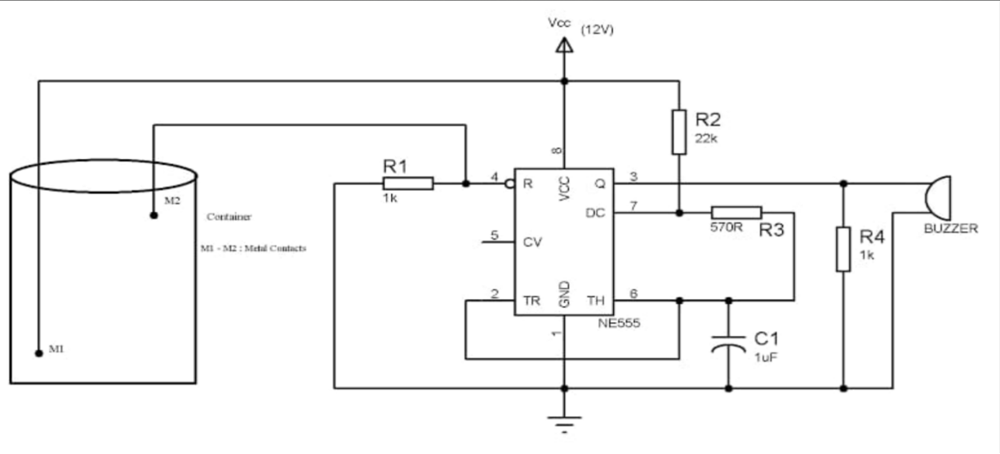

# ⚡ AUTOMATIC WATER LEVEL CONTROLLER

A smart and automatic system to monitor and control the water level in a tank using a **555 Timer IC**. The pump turns **ON** when water is low and **OFF** when the tank is full — saving water, energy, and time. 💧⚙️

---

## 📘 **Abstract**

This project presents an **automatic water level controller** that uses the **555 timer IC in bistable mode** to detect tank water levels.
When the water level is low, the pump turns **ON**.
When the tank is full, the pump turns **OFF** automatically.
This prevents overflow, conserves water, and protects the pump from dry running.

---

## 🏁 **Introduction**

An automatic water level controller monitors and maintains water levels without human involvement.
Using level probes and a 555 timer IC, the system activates the pump when water falls to the lower threshold and deactivates it when the upper threshold is reached.
Ideal for **homes, agriculture, industries, and buildings**.

---

## 🔧 **Components Used**

* 555 Timer IC – Bistable multivibrator
* BC547 Transistor – Relay driver
* 12V Relay – Controls pump
* IN4007 Diode – Reverse voltage protection
* Resistors (1MΩ, 1kΩ) – Threshold setting & current limiting
* LED – Indication
* Water Level Sensors – High & Low detection

---

## 🔌 **Circuit Diagram**

## ⚙️ **Working Principle**

* **Water Level Sensing:** Probes detect high & low levels.
* **555 Timer:** Works as a bistable multivibrator controlling the pump logic.
* **Relay Activation:** Pump turns **ON** when water is low and **OFF** when tank is full.
* **Protection:** IN4007 diode protects relay driver transistor.

---
## Hardware Diagram

## ⭐ Advantages

* ✔️ Fully automatic
* ✔️ Water-saving
* ✔️ Energy efficient
* ✔️ Safe pump operation (no dry running)
* ✔️ Low-cost components

---

## 🌍 Impact

* Residential water tanks
* Agriculture irrigation control
* Industrial water systems
* Commercial building tanks
* Flood prevention in basements

---

## 🏁 Conclusion

The automatic water level controller is an efficient, cost-effective, and reliable solution for water tank automation. With future upgrades such as IoT monitoring, this system can be extended into a smart water management solution.

---

## 📄 Documentation & Files
[Documentation PPT](PROJECT.pptx)

## 🙏 Thank You!

